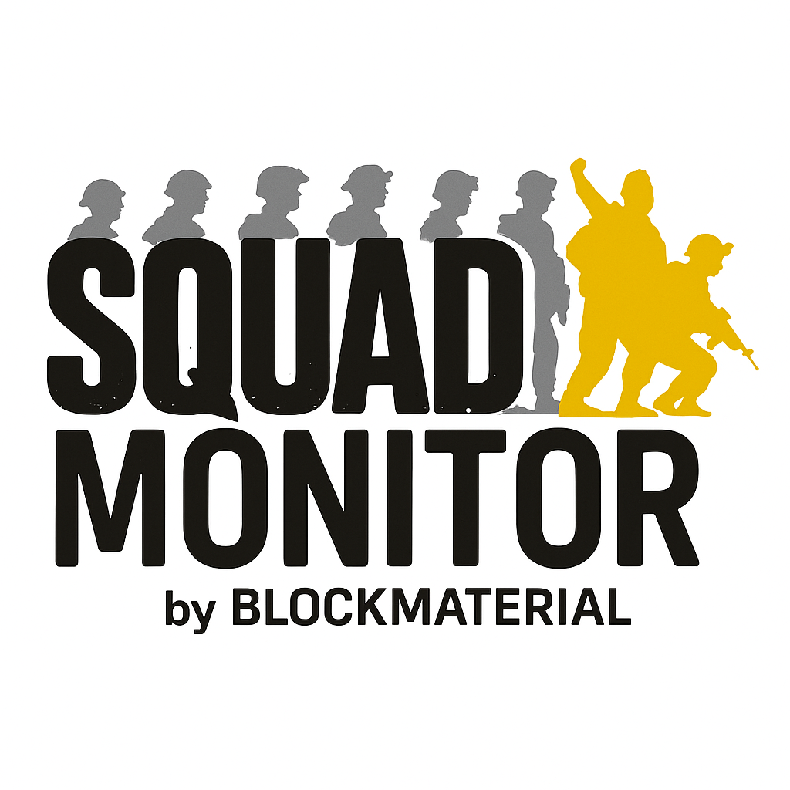

# Squad Queue Monitor

Squad Queue Monitor is a desktop application that automatically monitors your position in the Squad game queue and notifies you when you enter the server. The application uses screen capture and OCR (Optical Character Recognition) technology to detect your queue status without interacting with the game process.


## Features

- **Process-Based Detection**: Automatically detects the running Squad game process
- **Queue Position Monitoring**: Tracks your position in the server queue
- **Automatic Notifications**: Audio and visual alerts when you enter the server
- **Multi-Language Support**: Includes English and Ukrainian interfaces
- **Customizable Settings**: Adjust queue detection patterns, process name, and more
- **Debug Tools**: Test your settings, view logs, and save screenshots for troubleshooting

## Requirements

- Windows (tested on Windows 10 and 11)
- Python 3.7 or higher
- Squad Game (must be installed for monitoring)
- Tesseract OCR (included in the installation)

## Installation

### Option 1: Download Pre-Built Executable (Recommended)

1. Download the latest release from [GitHub Releases](https://github.com/yourusername/squad-queue-monitor/releases)
2. Extract the ZIP file to a location of your choice
3. Run `SquadQueueMonitor.exe`

### Option 2: Install from Source

1. Clone the repository:
   ```bash
   git clone https://github.com/yourusername/squad-queue-monitor.git
   cd squad-queue-monitor
   ```

2. Install requirements:
   ```bash
   pip install -r requirements.txt
   ```

3. Run the application:
   ```bash
   python main.py
   ```

## Usage

1. Start the Squad game and join a server queue
2. Launch Squad Queue Monitor
3. The application will automatically detect the game process
4. Click "Start Monitoring" to begin tracking your queue position
5. A notification will appear when you enter the server

## Settings

- **Check Interval**: How often the application checks your queue status (in seconds)
- **Game Process Name**: The name of the Squad game process (usually "SquadGame.exe")
- **Queue Pattern**: The regular expression pattern used to detect queue position
- **In-Game Indicators**: Words that indicate you are in-game (separated by commas)

## Troubleshooting

- **Game Not Detected**: Click "Show Process List" to manually select the Squad game process
- **Queue Not Detected**: Check the debug tab, run the OCR test, and adjust queue pattern if needed
- **Debug Mode**: Enable "Save screenshots and text on each check" to save debug information

## Contributing

Contributions are welcome! Please feel free to submit a Pull Request.

## License

This project is licensed under the MIT License - see the LICENSE file for details.

---

# Монітор черги Squad

Монітор черги Squad - це настільний додаток, який автоматично відстежує вашу позицію в черзі гри Squad і сповіщає вас, коли ви входите на сервер. Додаток використовує технологію захоплення екрану та OCR (оптичне розпізнавання символів) для виявлення статусу вашої черги без взаємодії з процесом гри.



## Функції

- **Виявлення на основі процесу**: Автоматично виявляє запущений процес гри Squad
- **Моніторинг позиції в черзі**: Відстежує вашу позицію в черзі сервера
- **Автоматичні сповіщення**: Звукові та візуальні сповіщення, коли ви входите на сервер
- **Підтримка кількох мов**: Включає англійський та український інтерфейси
- **Налаштування**: Налаштування шаблонів виявлення черги, назви процесу тощо
- **Інструменти відлагодження**: Тестування налаштувань, перегляд логів та збереження скріншотів для усунення несправностей

## Вимоги

- Windows (протестовано на Windows 10 та 11)
- Python 3.7 або вище
- Гра Squad (повинна бути встановлена для моніторингу)
- Tesseract OCR (включено в інсталяцію)

## Встановлення

### Варіант 1: Завантажити готовий виконуваний файл (Рекомендовано)

1. Завантажте останню версію з [GitHub Releases](https://github.com/yourusername/squad-queue-monitor/releases)
2. Розпакуйте ZIP-файл у місце за вашим вибором
3. Запустіть `SquadQueueMonitor.exe`

### Варіант 2: Встановлення з вихідного коду

1. Клонуйте репозиторій:
   ```bash
   git clone https://github.com/yourusername/squad-queue-monitor.git
   cd squad-queue-monitor
   ```

2. Встановіть залежності:
   ```bash
   pip install -r requirements.txt
   ```

3. Запустіть додаток:
   ```bash
   python main.py
   ```

## Використання

1. Запустіть гру Squad і приєднайтеся до черги на сервер
2. Запустіть Монітор черги Squad
3. Додаток автоматично виявить процес гри
4. Натисніть "Запустити моніторинг", щоб почати відстеження вашої позиції в черзі
5. Сповіщення з'явиться, коли ви увійдете на сервер

## Налаштування

- **Інтервал перевірки**: Як часто додаток перевіряє статус вашої черги (в секундах)
- **Назва процесу гри**: Назва процесу гри Squad (зазвичай "SquadGame.exe")
- **Шаблон черги**: Регулярний вираз для виявлення позиції в черзі
- **Індикатори входу в гру**: Слова, які вказують, що ви вже в грі (розділені комами)

## Усунення несправностей

- **Гра не виявлена**: Натисніть "Показати список процесів", щоб вручну вибрати процес гри Squad
- **Черга не виявлена**: Перевірте вкладку відлагодження, запустіть тест OCR і налаштуйте шаблон черги, якщо потрібно
- **Режим відлагодження**: Увімкніть "Зберігати скріншоти та текст при кожній перевірці" для збереження інформації для відлагодження

## Співпраця

Запрошуємо до співпраці! Будь ласка, не соромтеся подавати Pull Request.

## Ліцензія

Цей проект ліцензований за ліцензією MIT - деталі дивіться у файлі LICENSE.